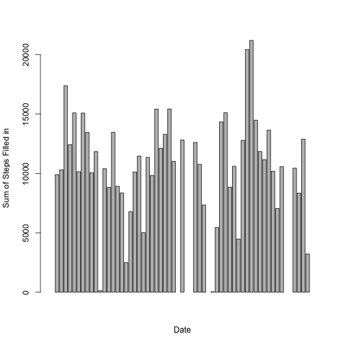

Reproducible Research
Activity Data Analysis (Assignment #1)
========================================================

This is an R Markdown document to analyze activity data.

The variables included in this analysis are date, steps and time interval.


```r
##Read in csv file
d<-read.csv("/activity.csv")
```

```
## Warning in file(file, "rt"): cannot open file '/activity.csv': No such
## file or directory
```

```
## Error in file(file, "rt"): cannot open the connection
```

```r
steps<-d[,1]
```

```
## Error in eval(expr, envir, enclos): object 'd' not found
```

```r
date<-d[,2]
```

```
## Error in eval(expr, envir, enclos): object 'd' not found
```

```r
interval<-d[,3]
```

```
## Error in eval(expr, envir, enclos): object 'd' not found
```

```r
##Identify NA steps
missing<-is.na(steps)
```

```
## Error in eval(expr, envir, enclos): object 'steps' not found
```

```r
d2<-data.frame(steps,date,interval,missing)
```

```
## Error in data.frame(steps, date, interval, missing): object 'steps' not found
```

```r
steps<-d2[,1]
```

```
## Error in eval(expr, envir, enclos): object 'd2' not found
```

```r
date<-d2[,2]
```

```
## Error in eval(expr, envir, enclos): object 'd2' not found
```

```r
interval<-d2[,3]
```

```
## Error in eval(expr, envir, enclos): object 'd2' not found
```

```r
missing<-d2[,4]
```

```
## Error in eval(expr, envir, enclos): object 'd2' not found
```

```r
##Subset for complete values
subset<-d2[missing==FALSE,]
```

```
## Error in eval(expr, envir, enclos): object 'd2' not found
```

```r
steps<-subset[,1]
```

```
## Error in subset[, 1]: object of type 'closure' is not subsettable
```

```r
date<-subset[,2]
```

```
## Error in subset[, 2]: object of type 'closure' is not subsettable
```

```r
interval<-subset[,3]
```

```
## Error in subset[, 3]: object of type 'closure' is not subsettable
```

```r
##date<-as.Date(summary[,1], "%m/%d/%y")
```

What is mean total number of steps taken per day?

Barplot of Total Number of Steps 

```r
library(plyr)

summary<-ddply(subset,~date,summarize,sum=sum(steps))
```

```
## Error in if (empty(.data)) return(.data): missing value where TRUE/FALSE needed
```

```r
date<-as.Date(summary[,1], "%m/%d/%y")
```

```
## Error in summary[, 1]: object of type 'closure' is not subsettable
```

```r
sum.steps<-summary[,2]
```

```
## Error in summary[, 2]: object of type 'closure' is not subsettable
```

```r
barplot(sum.steps,xlab="Date",ylab="Sum of Steps")
```

```
## Error in barplot(sum.steps, xlab = "Date", ylab = "Sum of Steps"): object 'sum.steps' not found
```

Mean Number of Steps

```r
##library(plyr)

mean.summary<-ddply(subset,~date,summarize,sum=mean(steps))
```

```
## Error in if (empty(.data)) return(.data): missing value where TRUE/FALSE needed
```

```r
print(mean.summary)
```

```
## Error in print(mean.summary): object 'mean.summary' not found
```

Median Number of Steps

```r
##library(plyr)
med.summary<-ddply(subset,~date,summarize,med=median(steps))
```

```
## Error in if (empty(.data)) return(.data): missing value where TRUE/FALSE needed
```

```r
print(med.summary)
```

```
## Error in print(med.summary): object 'med.summary' not found
```

What is the average daily activity pattern?

Timeseries plot of Mean


```r
mean.summary<-ddply(subset,~date+interval,summarize,sum=mean(steps))
```

```
## Error in if (empty(.data)) return(.data): missing value where TRUE/FALSE needed
```

```r
m.interval<-ts(mean.summary[,2])
```

```
## Error in is.data.frame(data): object 'mean.summary' not found
```

```r
m.steps<-mean.summary[,3]
```

```
## Error in eval(expr, envir, enclos): object 'mean.summary' not found
```

```r
plot.ts(m.steps)
```

```
## Error in NCOL(x): object 'm.steps' not found
```

Imputing missing values


```r
install.packages("zoo")
```

```
## Error in contrib.url(repos, "source"): trying to use CRAN without setting a mirror
```

```r
library(zoo)
```

```
## 
## Attaching package: 'zoo'
## 
## The following objects are masked from 'package:base':
## 
##     as.Date, as.Date.numeric
```

```r
d<-read.csv("/Users/cynthiacozzetto/activity.csv")
steps<-d[,1]
date<-d[,2]
interval<-d[,3]
##steps2<-na.approx(steps) 
steps[is.na(steps)]<-mean(steps)

d3<-data.frame(steps,date,interval)


summary<-ddply(d3,~date,summarize,sum=sum(steps))
date<-as.Date(summary[,1], "%m/%d/%y")
sum.steps<-summary[,2]
barplot(sum.steps,xlab="Date",ylab="Sum of Steps Filled in")
```

 


Are there differences in activity patterns between weekdays and weekends?


```r
install.packages("timeDate")
```

```
## Error in contrib.url(repos, "source"): trying to use CRAN without setting a mirror
```

```r
library(timeDate)
```

```
## Warning: package 'timeDate' was built under R version 3.1.2
```

```r
weekday<-isWeekday(date1)
```

```
## Error in as.POSIXlt(x, tz = "GMT"): object 'date1' not found
```

```r
wd<-data.frame(weekday,steps,interval,date1)
```

```
## Error in data.frame(weekday, steps, interval, date1): object 'weekday' not found
```

```r
mean.summary<-ddply(wd,~weekday,summarize,sum=mean(steps))
```

```
## Error in empty(.data): object 'wd' not found
```

```r
plot(steps,date)
```

```
## Error in xy.coords(x, y, xlabel, ylabel, log): 'x' and 'y' lengths differ
```

```r
install.packages("ggplot2")
```

```
## Error in contrib.url(repos, "source"): trying to use CRAN without setting a mirror
```

```r
library(ggplot2)
ggplot(wd, aes(steps)) + geom_bar() +facet_wrap(~ weekday)
```

```
## Error in ggplot(wd, aes(steps)): object 'wd' not found
```


##Plot weekday versus weekend, figure out median, resubmit


