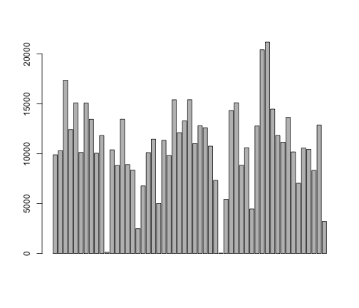

Activity Data Analysis
========================================================

This is an R Markdown document to analyze activity data.

The variables included in this analysis are date, steps and time interval.


```r
d<-read.csv("/Users/cynthiacozzetto/activity.csv")
steps<-d[,1]
date<-d[,2]
interval<-d[,3]

missing<-is.na(steps)
d2<-data.frame(steps,date,interval,missing)
steps<-d2[,1]
date<-d2[,2]
interval<-d2[,3]
missing<-d2[,4]

subset<-d2[missing==FALSE,]

steps<-subset[,1]
date<-subset[,2]
interval<-subset[,3]
##date<-as.Date(summary[,1], "%m/%d/%y")
```

Barplot of Total Number of Steps 

```r
library(plyr)

summary<-ddply(subset,~date,summarize,sum=sum(steps))
date<-as.Date(summary[,1], "%m/%d/%y")
barplot(summary[,2])

barplot(summary[,2])
```

 


Timeseries plot of Mean

```r
mean.summary<-ddply(subset,~date+interval,summarize,sum=mean(steps))
m.interval<-ts(mean.summary[,2])
m.steps<-mean.summary[,3]

plot.ts(m.steps)
```

 


